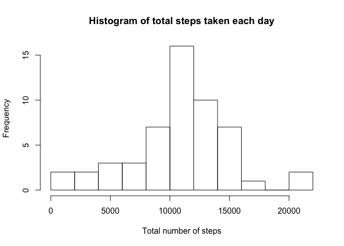
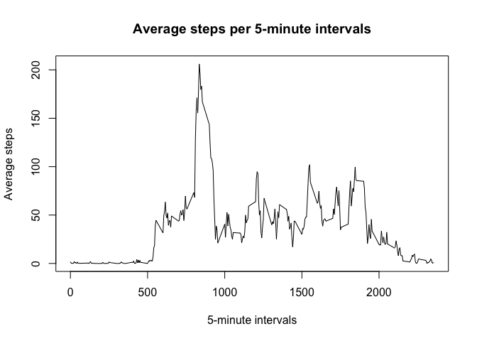
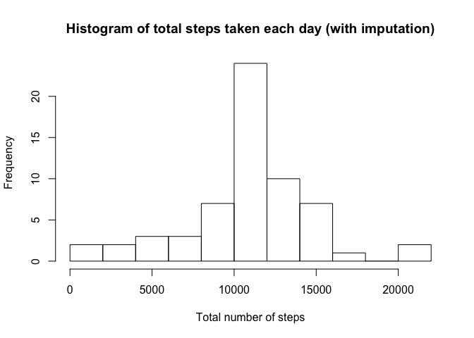
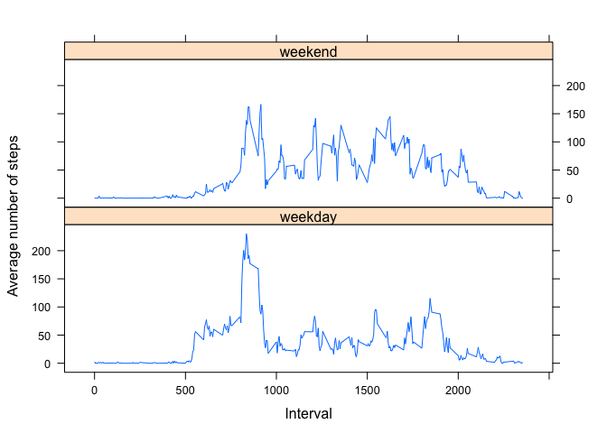

# Reproducible Research: Peer Assessment 1


### Activity monitor data:

Download data from [here](https://d396qusza40orc.cloudfront.net/repdata%2Fdata%2Factivity.zip) [52K] and unzip the file to extract dataset "activity.csv"


Load data:

```r
data <- read.csv("activity.csv")
```


### What is mean total number of steps taken per day?

Process and summarize data to calculate the total, mean, and median steps taken per day

```r
library(dplyr)
```


```r
data %>% group_by(date) %>% filter(!is.na(steps)) %>%
    summarize(sum=sum(steps, na.rm=TRUE), 
              mean=mean(steps, na.rm=TRUE), 
              median=median(steps, na.rm=TRUE)
              ) ->dataSummary
```


Histogram of the total number of steps taken each day

```r
hist(dataSummary$sum, 
     breaks = 10, 
     xlab = "Total number of steps", 
     main = "Histogram of total steps taken each day")
```

 

Mean and median of the total number of steps taken per day

```r
summary(dataSummary$sum)
```

```
##    Min. 1st Qu.  Median    Mean 3rd Qu.    Max. 
##      41    8841   10760   10770   13290   21190
```
Mean and Median of the total number of steps are 10770 and 10760, respectively


### What is the average daily activity pattern?

Time series plot of average steps per 5-minute interval

```r
# calculate the interval average
data %>% filter(!is.na(steps)) %>% group_by(interval) %>% 
    summarize(average=mean(steps)
              ) ->intervalAverage

# time series plot
with(intervalAverage, 
     plot(x=interval, y=average, 
          type="l",
          xlab="5-minute intervals", ylab="Average steps",
          main="Average steps per 5-minute intervals"))
```

 


Extracting the interval that contains the maximum average number of steps

```r
intervalAverage %>% filter(average==max(average))
```

```
## Source: local data frame [1 x 2]
## 
##   interval  average
## 1      835 206.1698
```


### Imputing missing values

Calculate the number of oberservations that contain missing values

```r
data %>% filter(is.na(steps)) %>% summarize(n())
```

```
##    n()
## 1 2304
```


Inpute missing values with the average of their corresponding time intervals

```r
# create a new data frame 'dataImpute' for processing
dataImpute<-data

# replace NA with average steps of its corresponding 5-minute interval
# this average was previously calculated and saved in the data frame 'intervalAverage'
dataImpute[which(is.na(dataImpute$steps)),1]<-intervalAverage$average
# the new dataset 'dataImpute' is equal to the original dataset 'data' but with missing values filled in

# summarize this new dataset
dataImpute %>% group_by(date) %>%
    summarize(sum=sum(steps, na.rm=TRUE), 
              mean=mean(steps, na.rm=TRUE), 
              median=median(steps, na.rm=TRUE)
              ) ->dataImputeSummary
```


Histogram of the total number of steps taken each day with missing vlues imputed

```r
hist(dataImputeSummary$sum, 
     breaks = 10, 
     xlab = "Total number of steps", 
     main = "Histogram of total steps taken each day (with imputation)")
```

 


Mean and median of the total number of steps taken per day

```r
summary(dataImputeSummary$sum)
```

```
##    Min. 1st Qu.  Median    Mean 3rd Qu.    Max. 
##      41    9819   10770   10770   12810   21190
```
After imputing missing values, the Mean and Median are both 10770.

This is only slightly different from the Mean and Meidian before imputing, which are 10770 and 10760, respectively.

Imputing missing values brought the Median closer to the Mean and shifted the 1st and 3rd quantiles.


### Are there differences in activity patterns between weekdays and weekends?


```r
# converting the 'date' variable from class()=factor to class()=date 
dataImpute$date<-as.Date(dataImpute$date)
```

Create a new factor variable in the dataset indicating "weekday" and "weekend" 


```r
library(timeDate)
```


```r
dataImpute$weekday <- isWeekday(dataImpute$date, wday=1:5)
dataImpute[which(dataImpute$weekday==TRUE),4]<-"weekday"
dataImpute[which(dataImpute$weekday==FALSE),4]<-"weekend"
dataImpute$weekday<-as.factor(dataImpute$weekday)
```

Panel plot containing a time series plot (i.e. type = "l") of the 5-minute interval (x-axis) and the average number of steps taken, averaged across all weekday days or weekend days (y-axis)


```r
# summarize data to calculate the average steps in each 5-minute interval during weekdays or weekends
dataImpute %>% group_by(weekday, interval) %>% summarize(average=mean(steps)) -> average_wdays
```


```r
library(lattice)
```


```r
# create panels of time series plot for average steps taken during weekdays or weekends
xyplot(average ~ interval | weekday, type = "l", data = average_wdays, 
       xlab = "Interval",
       ylab = "Average number of steps",
       layout = c(1,2))
```

 

